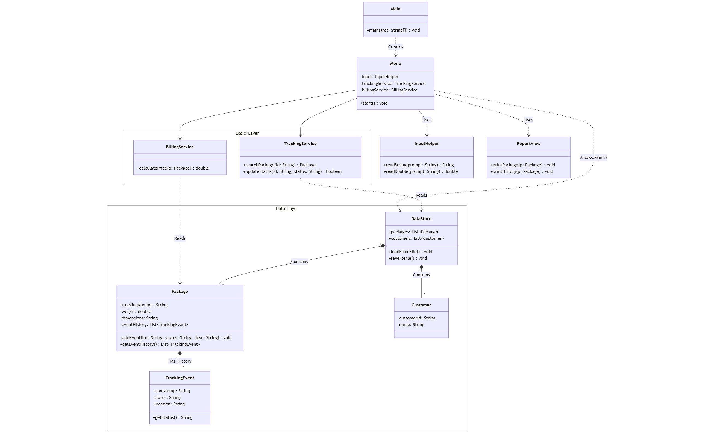

# parcel-tracking-system

## 1. 系統架構設計 (System Architecture) 類別圖
本專案採用 **三層式架構 (3-Tier Architecture)** 設計，確保高內聚與低耦合。下圖為系統完整類別圖，包含視圖層、邏輯層與資料層的互動關係。



---

## 2. 資料層核心設計 (Data Layer Detail) 類別圖
本系統的資料核心由組員 A (我) 負責設計與實作，採用物件導向設計原則，確保資料模型的完整性與擴充性。

```mermaid
classDiagram
    class Customer {
        -String customerId
        -String name
        -String phone
        -boolean isContract
        +Customer(id, name, phone, isContract)
        +toString() String
        +getCustomerId() String
        +getName() String
        +getPhone() String
        +isContract() boolean
    }

    class TrackingEvent {
        -String timestamp
        -String location
        -String status
        -String description
        +TrackingEvent(time, loc, status, desc)
        +toString() String
        +getTimestamp() String
        +getLocation() String
        +getStatus() String
        +getDescription() String
    }

    class Package {
        -String trackingNumber
        -String senderId
        -String receiverName
        -String receiverAddress
        -double weight
        -String serviceType
        -String currentStatus
        -List~TrackingEvent~ eventHistory
        +Package(trackNum, sender, receiver, addr, w, type)
        +addEvent(loc, status, desc) void
        +toString() String
        +getTrackingNumber() String
        +getSenderId() String
        +getReceiverName() String
        +getReceiverAddress() String
        +getWeight() double
        +getServiceType() String
        +getEventHistory() List~TrackingEvent~
    }

    class DataStore {
        +static List~Package~ packages
        +static List~Customer~ customers
        +static initData() void
        +static saveToFile() void
        +static loadFromFile() void
    }

    %% Relationships
    DataStore o--> "0..*" Customer : manages
    DataStore o--> "0..*" Package : manages
    Package *--> "0..*" TrackingEvent : contains history
    Package ..> Customer : senderId refers to >